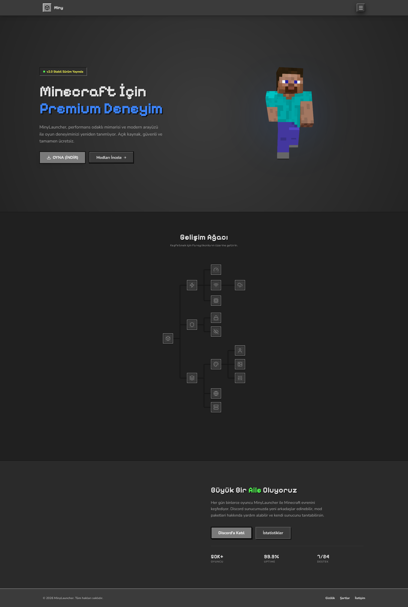

# Miny Launcher



> **Modern. Hızlı. Obsidyen Şıklığı.**
>
> Miny Launcher, Minecraft dünyasını modern web teknolojileriyle buluşturan, "Obsidian Glass" tasarım diline sahip yeni nesil bir arayüz projesidir.

[](https://opensource.org/licenses/MIT)
[](https://www.typescriptlang.org/)
[](https://react.dev/)
[](https://tailwindcss.com/)
[](https://bun.sh/)

## 🎨 Tasarım Felsefesi

Bu proje sıradan bir web sitesi değildir. **Oyunun bir uzantısıdır.**
Arayüz, Minecraft'ın orijinal "Inventory GUI" yapısını, modern "Glassmorphism" ve "Dark Mode" estetiğiyle harmanlar.

*   **Obsidian Glass:** Yarı saydam, koyu, buzlu cam paneller.
*   **Inventory Slots:** Tüm input ve kutular, oyun içi envanter slotları gibi tasarlanmıştır.
*   **Canlı Karakter:** 3D Steve modeli, mouse hareketlerinizi takip eder.
*   **Dinamik Akış:** Sayfalar arası geçişler yumuşak ve animasyonludur.

## 🚀 Özellikler

*   **Oyuncu Paneli (Dashboard):** İstatistiklerinizi, karakterinizi ve son paketlerinizi tek ekrandan yönetin.
*   **Auth Flow:** Microsoft ile tek tıkla giriş veya çevrimdışı (offline) mod seçeneği.
*   **Mod Paketleri:** Binlerce mod paketi arasında gezinin, detaylarını "Yazılmış Kitap" formatında inceleyin.
*   **Gardırop:** Karakterinizin skinini 3D olarak görüntüleyin ve yönetin.
*   **Hikaye Kitapları:** Gizlilik, Şartlar ve İletişim sayfaları, oyun içi kitap formatındadır.

## 🛠️ Kurulum ve Çalıştırma

Bu proje **BUN** runtime üzerine kuruludur. Node.js kullanıyorsanız da çalışır ancak Bun önerilir.

### 1. Projeyi Klonlayın
```bash
git clone https://github.com/hamzzkkaya/project-miny.git
cd project-miny
```

### 2. Bağımlılıkları Yükleyin
```bash
bun install
# Veya npm kullanıyorsanız: npm install
```

### 3. Geliştirme Sunucusunu Başlatın
```bash
bun run dev
```

### 4. Build Alın (Production)
```bash
bun run build
```

## 📂 Proje Yapısı

```
src/
├── assets/          # Görseller ve ikonlar
├── components/      # Atomik bileşen mimarisi
│   ├── features/    # ModCard, SkinViewer gibi özellikler
│   ├── layout/      # Navbar, Footer, Sidebar
│   └── ui/          # Button, Input, Card (Temel taşlar)
├── pages/           # Sayfa routeları (Home, Dashboard, Register)
└── utils/           # Yardımcı fonksiyonlar
```

## 🤝 Katkıda Bulunma

1.  Bu depoyu Forklayın.
2.  Yeni bir Branch oluşturun (`git checkout -b feature/YeniOzellik`).
3.  Değişikliklerinizi Commit edin (`git commit -m 'Yeni özellik eklendi'`).
4.  Branch'inizi Pushlayın (`git push origin feature/YeniOzellik`).
5.  Bir **Pull Request** açın.

## 📄 Lisans

Bu proje [MIT Lisansı](LICENSE) ile lisanslanmıştır. Özgürce çatallayabilir, değiştirebilir ve kullanabilirsiniz.

---
*Developed with ❤️ by hamzzkkaya*
